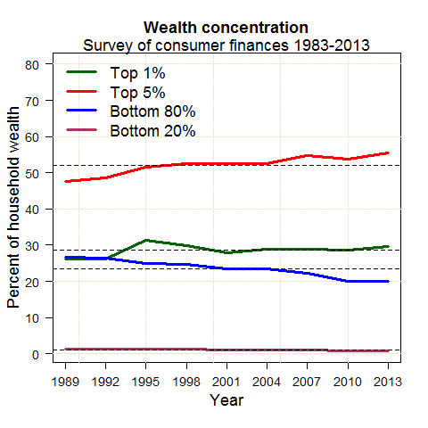
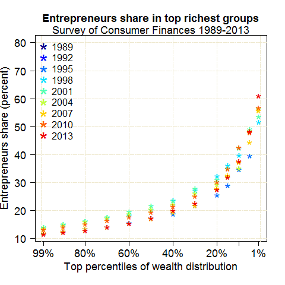
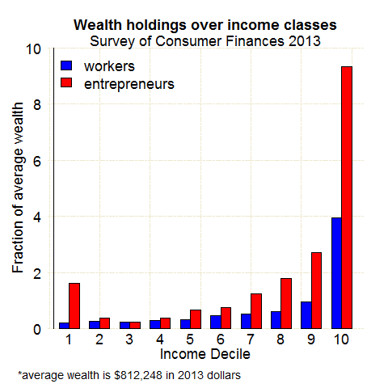

Stata programs used for generating three figures used in the old version of my job market paper.

Data source: Board of Governors of the Federal Reserve System, the triennial household survey, *Survey of Consumer Finances*[1] 

 ##### Figure 1. Wealth concentration

#####Figure 2. Share of business households

#####Figure 3. Average asset holdings by income decile groups

footnote

[1] one of the authoritative U.S. household survey on items of balance sheets